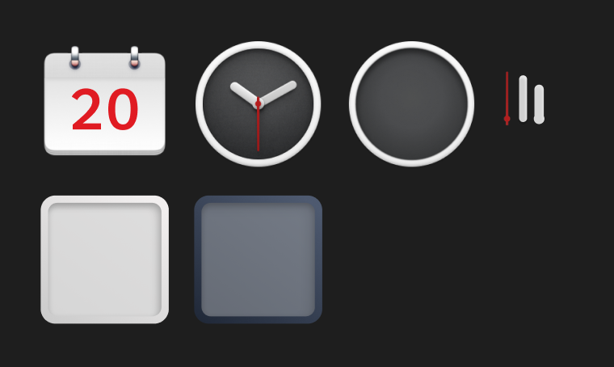

# SmartisanTheme-on-Huawei

## 简介

这个库是用来分享基于锤子系统素材而构建的华为主题。重绘了日历，天气，和时钟，基于Smartisan OS原版的风格。华为原生App部分由Smartisan图标和meeye图标替代。息屏动画采用了Smartisan Pro3宣传视频结尾的红灯呼吸结合锤子论坛Logo组合而成。第三方未重绘的图标采用了统一的遮罩形式，来模拟图标被装在盒白色盒子中的效果，并有光影从右上往左下角照射。

## 使用方法

将 `Smartisan X.XX.hwt` 下载到本地，并保存到华为手机中的 `内部储存>Huawei>Themes` 目录中，主题将会在大概2-3分钟后成功刷新在华为 `主题` App中的 `我的>主题` 内。（华为平板同理）

  

## 图标重绘和第三方图标处理
1. **天气图标重绘**：根据华为主题格式的15个天气图标映射，基于Smartisan OS原版的天气图标进行重绘。

  

2. **日历和时钟图标重绘**：根据华为主题的日历和时钟格式，基于Smartisan OS原版的时钟和日历图标进行重绘。

3. **小文件夹图标重绘**：基于Smartisan OS风格进行的小文件夹重绘，分别为浅色模式和深色模式。

  

4. **第三方图标处理**：使用Smartisan OS原版原木壁纸作为不规则图标的背景（`icon_background`），适当的图标裁切大小（`icon_mask`），以及适当的图标框来体现光影照射图标的效果，并且匹配Smartisan OS原版图标大小（`icon_border`）。

  

## 后续更新
目前 `Smartisan 1.71.hwt` 处于各方面都比较完善的版本，可以直接使用。后续的更新和微调也会在这个基础上进行。假设时间允许，会逐步基于Smartisan OS原版的风格重绘华为原生图标以替代当前部分meeye的图标，更新日志也会在这个板块写明。

- **Smartisan 1.71.hwt** : 当前的基础稳定可用版本 （2024-12-29）

- **Smartisan 1.72.hwt** : 为所有图标添加了合适的阴影，在纯色或浅色背景下有更加立体的表现 （2025-1-14）

  

